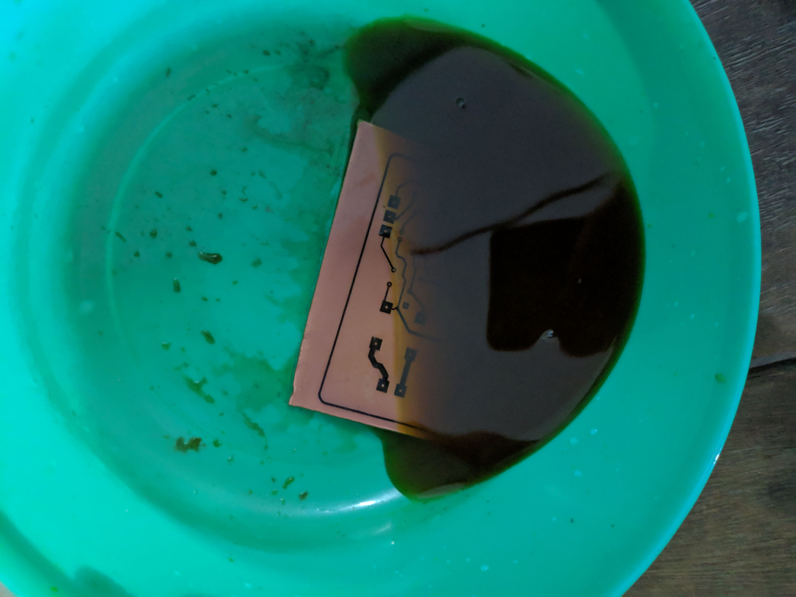
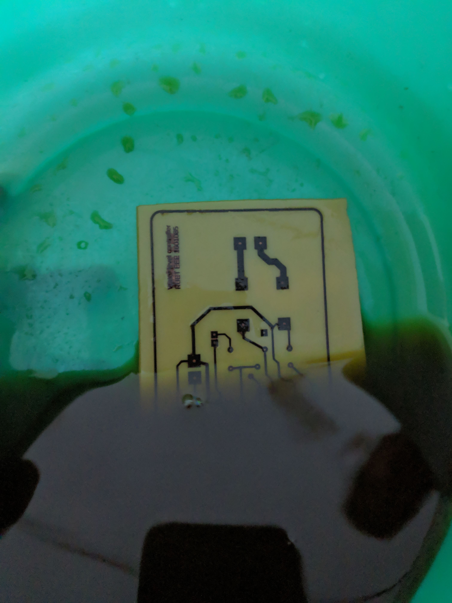

# Two point water level controller
A circuit capable of controlling a motor based on the input from two float sensor representing two water levels in a tank is designed and referred to as two point water level controller. It is showed that simple components like 555 timer, resistors, ralys, transistors and led’s can be used to make a fully functioning two point water level controller with features like power indication and motor on-off indication. It is a cheap solution to controll water level of tanks.

### Working principle

In the circuit the relay which controls the motor is controlled by output of the 555 timer. The timer is the main component of the circuit. From the operating principle of  555 timer it is known that if the trigger input becomes lower than the voltage at the non-inverting input of the internal comparator 2 (i.e. VCC ⁄3) the output of internal comparator 2 (i.e., the S input to the flip-flop) will be high. As a result, the Q output of the flip-flop will be set to high. Thus, Q’ will be low, and the discharge transistor Q1 will be off. If the threshold input becomes higher than the voltage at the inverting input of internal comparator 1 (i.e. 2VCC ⁄3), the output of internal comparator 1 will be high. As a result, the Q output of the flip-flop will be reset to low. Thus, Q’ will be high, and the discharge transistor Q1 will be on (in saturation), providing a discharge
path. In this project only the output Q of the flip-flop is utilized. Two float sensors/switches are attached in the tank which provide signal to the trigger and threshold pin of the timer based on which the motor is turned on/off.

### Full circuit diagram

The circuit was designed and simulated in proteus.

### Operation

Float switch fs1 is positioned near the bottom of the tank and  Float switch fs2  is positioned near the top of the tank. 12V power is supplied to the circuit and the motor is connected to the relay.
The circuit operates as follows:
    1. When the water level falls below fs1 the switch becomes open and the relay is energized and the motor starts which raises the water level. This happens because the trigger  and the threshold of the timer is pulled low  which makes the output of timer high energizing the relay
    2. When the water level is between fs1 and fs2 the timer remembers previous state and the motor continues to run because threshold is pulled low and trigger is pulled high so the output is kept high.
    3. When water level goes above fs2 both trigger and threshold is pulled high and the motor stops.
    4. When the water level is between fs1 and fs2 again the timer remembers previous state and the motor continues to stay off.
Then the operation starts from 1 and continues to 4 again and again keeps the water level between fs1 and fs2.

### Fabrication
Step 1

Transferring printed circuit on pcb board. The printing is done on glossy paper using laser pronter.

Then the paper is made wet and peeled of keeping the ink.

The access copper is etchedd using ferric cloride (FeCl~3). Only the traced path is remaining after etching.

Soldering the components

The built circuit.
